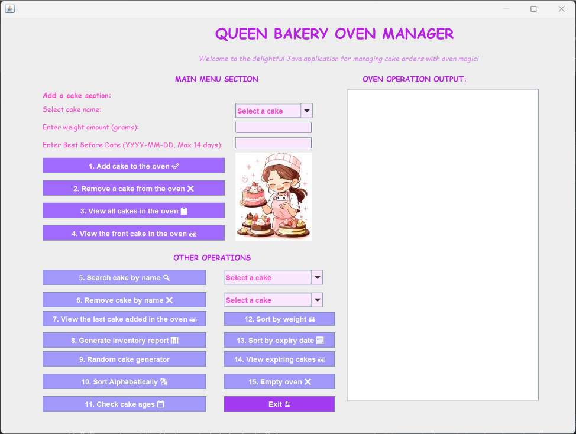
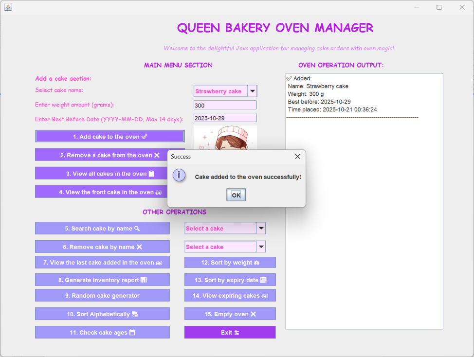
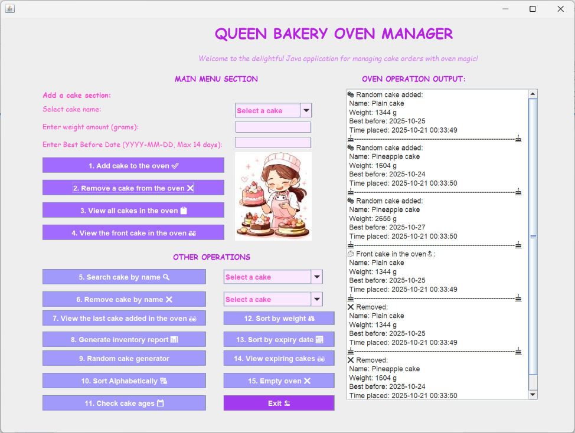
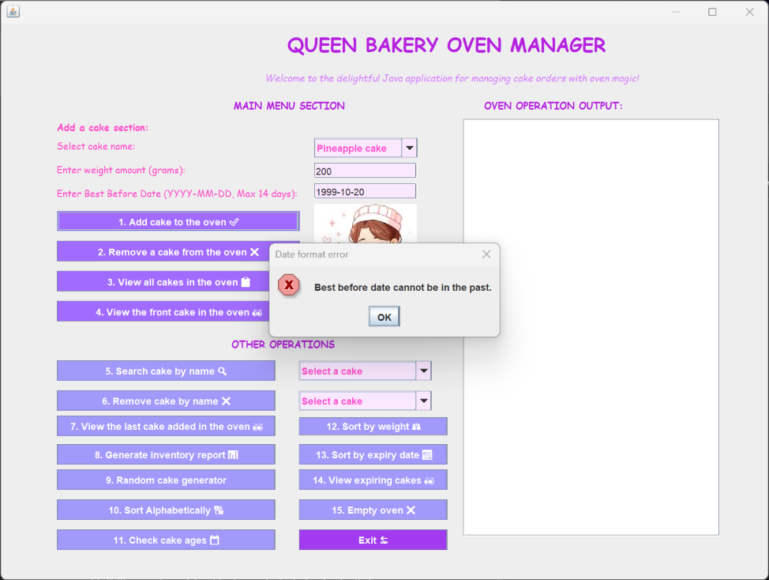
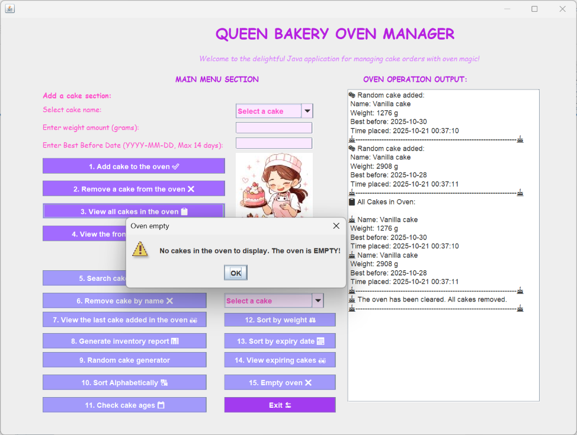

# 🍰 Cake App — Java Swing Queue Simulation


A desktop Java Swing app that demonstrates **Object-Oriented Programming (OOP)** and **Queue Data Structure (FIFO)** through a fun cake oven simulation.  
Developed as part of my Higher Diploma in Science in Computing.

---

## ✨ Features
- Add cakes with name, weight, and best-before date  
- FIFO queue system (first cake in → first cake out)  
- GUI built using **Java Swing (NetBeans)**  
- Real-time entry time tracking for cakes  
- Validation for expiry dates and input fields  

---

## 🧩 Technologies
| Tool | Purpose |
|------|----------|
| **Java (JDK 17)** | Core programming language |
| **Swing / NetBeans** | GUI design |
| **Ant** | Build automation |
| **Git & GitHub** | Version control and portfolio management |

---

## 📁 Project Structure
| File | Description |
|------|--------------|
| `Cake.java` | Model class storing cake details |
| `CakeQueue.java` | Queue logic for adding/removing cakes |
| `CakeAppGUI.java` | Graphical User Interface (Swing) |
| `CakeQueueInterface.java` | Defines methods for queue operations |

---

## 🧠 Learning Highlights
- Implementation of **OOP principles** (Encapsulation, Abstraction, Interfaces)  
- Working with **Queues (FIFO)**  
- Designing an interactive GUI  
- Combining frontend and backend logic in Java  

---

## 🧪 How to Run

### Option 1: Using NetBeans
1. Open NetBeans  
2. Go to **File → Open Project**  
3. Select the project folder  
4. Run `CakeAppGUI.java`


### Option 2: Using Terminal
```bash
ant clean jar
java -jar dist/CakeApp.jar
```

---

## 📸 Screenshots

### 🏠 Main Window

### 🍰 Add Cake Form

### 📋 Queue View

### ⚠️ Validation Message

### 🧁 Empty Oven



---

## 🏆 Future Improvements
- Add search and sorting features for cakes  
- Improve GUI layout and modernize color scheme  
- Add JUnit tests for CakeQueue logic  
- Export cake queue data to a CSV file  
- Implement better date validation with `LocalDate`

---

## 👩‍💻 Author
**Egshiglen Enkhbayar**  
📍 Dublin, Ireland  
🔗 [GitHub](https://github.com/egshiglen-henny) | [LinkedIn](https://linkedin.com/in/egshiglen)
